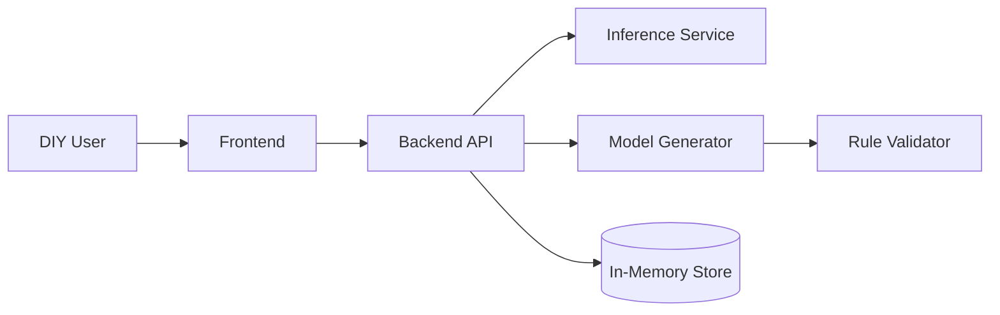
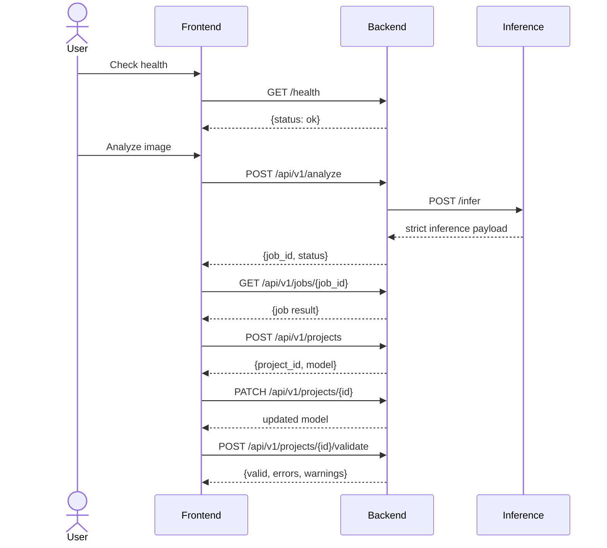
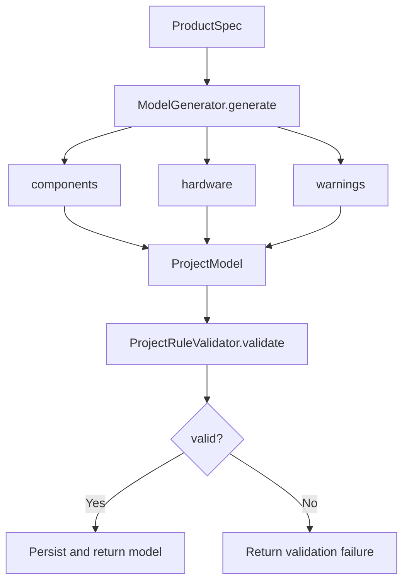
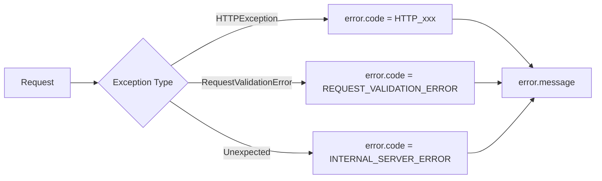

# Vision-to-Blueprint: AI-Converged Furniture Planning MVP

## Team Information
- Member 1: [Name], [Student ID]
- Member 2: [Name], [Student ID]

## Project Title
Vision-to-Blueprint: AI-Converged Furniture Planning MVP

## Abstract
DIY users can easily find furniture images but still struggle to produce buildable plans with valid dimensions, hardware quantities, and consistent structure. The main challenge is the AS-IS to TO-BE gap: AS-IS is manual interpretation from images and repeated trial-and-error, while TO-BE is an automated, editable, and validated workflow that starts from a single image. This project implements a practical MVP with three online components and one offline component: a frontend, a backend orchestration service, an inference service, and a training/export workspace. The frontend communicates only with the backend. The backend communicates with inference, stores analysis jobs, generates parametric cabinet models, and validates project rules. The inference service provides strict schema-based predictions for object type and suggested dimensions.

The MVP demonstrates a complete critical journey: health check, image analysis, job retrieval, project creation, project update, and validation. Rule-based checks detect invalid geometry and low-rigidity risks, while generated outputs include component lists and hardware estimates suitable for blueprint and BOM extension. The system is intentionally scoped to panel-based furniture and practical dimensions rather than full CAD/CAM completeness. This keeps implementation reliable and testable while preserving a clear path to future extensions such as persistence, asynchronous exports, and richer optimization.

Keywords: AI convergence, parametric furniture modeling, backend orchestration, rule validation, DIY fabrication

## Proposal (Condensed)
This project proposes an AI convergence workflow that converts a furniture image into an editable project model with rule-aware validation. The core user problem is not image access but actionable reconstruction. Users can already browse products online; they cannot reliably infer dimensions, panel dependencies, and hardware counts from visual references. The MVP therefore focuses on minimizing failure-causing ambiguity in the first complete version.

To remain consistent with the approved proposal plan, the MVP keeps explicit phase mapping: Week 4 data collection uses automated scraping with Requests and Selenium for furniture images and metadata, and Week 11 machine learning integrates supervised CNN-based structural recognition plus regression analysis for material and hardware quantity estimation. The current implementation focus is service-level integration and rule validation, while the model stack remains compatible with this planned training path.

The proposed system architecture separates concerns for reliability. The inference service is responsible for strict and stable prediction output. The backend is the control plane: it accepts frontend requests, calls inference, tracks jobs, creates project models, applies updates, and validates constraints. The frontend provides guided interaction states and never contacts inference directly. This boundary design reduces coupling and allows inference internals to evolve without breaking user-facing flows.

From a computational thinking view, the solution decomposes into five operations:
1. Analyze image and return a job id.
2. Retrieve normalized inference output.
3. Create a project model from suggested dimensions.
4. Edit core dimensions (width, height, depth, shelf count).
5. Validate model integrity and return errors/warnings.

Pattern recognition is used in a constrained way suitable for MVP: panel furniture tends to follow repeatable side-top-bottom-shelf structures. The model generator encodes this regularity as deterministic component formulas and hardware heuristics. Abstraction removes non-structural visual details and keeps only fabrication-relevant geometry. This approach supports predictable recalculation when users edit dimensions.

As the unique model-direction update from the proposal baseline, the detector track is set to YOLOv11 (latest YOLO generation) for furniture component detection, while preserving the CNN + regression formulation at the pipeline level. In other words, the object-level detection backbone is modernized, but the overall supervised-recognition and estimation strategy remains proposal-consistent.

Algorithmically, the workflow combines sequential, selection, and loop control:
1. Sequential path: analyze -> job -> create project.
2. Selection path: accept/reject updates based on rule validation.
3. Loop path: user updates dimensions and re-validates until acceptable.

MVP scope is intentionally practical. The project excludes advanced CAD editing, long-running optimization queues, and production-grade asset management in this phase. The expected contribution is a robust end-to-end baseline that proves image-to-editable-model feasibility with clear contracts and test coverage.

## Process and Implemented Features

### Implemented System Boundary
The system is implemented as frontend, backend, and inference services with backend-mediated orchestration.

Figure 1 explanation: This diagram shows the required boundary rule in practice. The frontend only calls backend; backend is the single gateway to inference and model logic.

### Request Sequence for MVP Journey
The implemented interaction path is shown below.

Figure 2 explanation: The sequence reflects the exact critical-path flow implemented and tested in this MVP.

### Model and Validation Logic
Generation and validation are modularized to keep rules maintainable.

Figure 3 explanation: The generator focuses on deterministic model construction, while validation is delegated to dedicated rule checks for dimensions, components, and hardware.

### Error and Response Consistency
Backend error handling now returns a consistent envelope for HTTP errors, validation errors, and internal errors.

Figure 4 explanation: Uniform error envelopes simplify frontend behavior and reduce endpoint-specific error parsing.

### Implemented Features in This MVP
1. Backend analyze -> job -> create/update/validate flow finalized.
2. Strict backend/inference contracts for dimensions and confidence ranges.
3. Modular rule validation separated from model generation.
4. Frontend minimal full journey with explicit loading and error states.
5. Critical-path backend tests and frontend API-flow tests.

### Proposal Traceability (What Is Used)
1. Data Collection (Week 4): Requests and Selenium are designated for automated furniture image and metadata acquisition in the training track.
2. Machine Learning (Week 11): Supervised CNN recognition and regression analysis remain the target modeling approach for structure and material requirement estimation.
3. Unique Differentiation: The recognition backbone is planned with YOLOv11 (latest YOLO generation) to improve practical detection quality while staying within the original ML framing.

## Expected Outcomes
1. Reduced manual interpretation effort for DIY users by converting images into editable model data.
2. Improved first-pass correctness through rule-based validation and consistent error handling.
3. Faster iteration cycles using backend-orchestrated project updates instead of manual recalculation.
4. Better foundation for future blueprint/BOM automation due to stable component and hardware outputs.
5. Clear path to scale from in-memory MVP to persistent, asynchronous production architecture.

## Final Development Notes (ACM-style)
<!-- ACM DEVELOPMENT NOTE: Next-step comments intentionally kept outside condensed proposal. -->
<!-- ACM NEXT STEP 1: Replace in-memory store with durable persistence and project versioning. -->
<!-- ACM NEXT STEP 2: Add asynchronous job queue for long-running inference and export tasks. -->
<!-- ACM NEXT STEP 3: Introduce export artifacts (2D sheets, BOM CSV, nesting previews) as separate services. -->
<!-- ACM NEXT STEP 4: Add failure-path integration tests for timeout, malformed inference payloads, and invalid edits. -->
<!-- ACM NEXT STEP 5: Add quality metrics in final demo (edit success rate, validation catch rate, and response latency). -->
