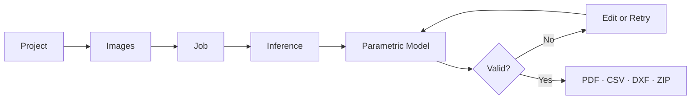
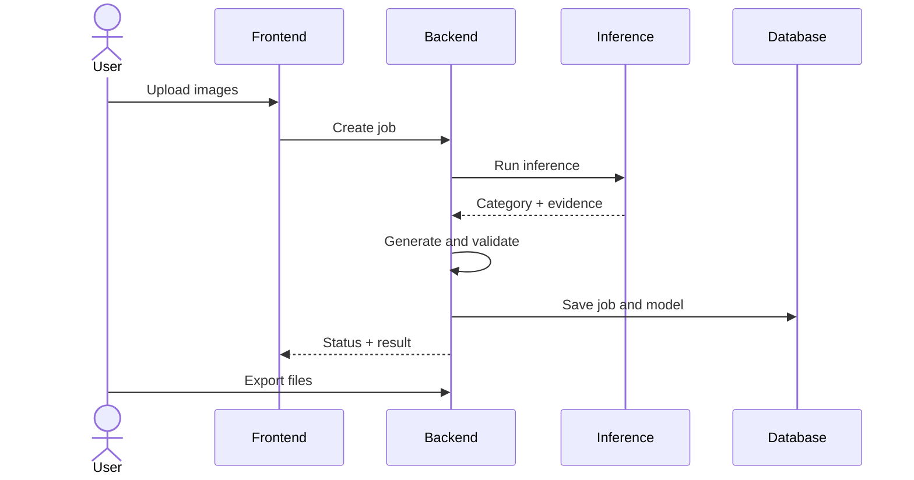
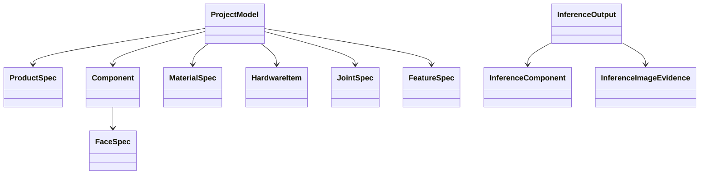

<!-- _class: lead -->

# Vision-to-Blueprint

## An Intelligent AI Convergence System for Automated Furniture Decomposition and Personalized Construction

**Franz Antony Bendezu Isidro**  
Student ID: **2024115282**  
AI Convergence Project · Week 16

---

# 1. Problem and Scope

- **AS-IS:** manual measurements, trial and error, material waste.
- **TO-BE:** image → editable model → validated exports.
- **MVP:** product categorization plus taxonomy-based generation.
- **Limit:** no fabrication-accurate 3D reconstruction from one photo.

  
  
  

---

# 2. Computational Thinking

- **Decomposition:** data, inference, model, validation, export.
- **Patterns:** panels, shelves, doors, drawers, joints.
- **Abstraction:** keep geometry and topology; remove scene noise.
- **Sequence:** upload → infer → generate → validate → export.
- **Selection:** invalid data is rejected.
- **Loop:** edits regenerate and revalidate the model.

---

# 3. End-to-End Flow

- **Input:** images and project parameters.
- **Evidence:** category, confidence, per-image result.
- **Output:** validated model and files.

  
  

---

# 4. Why Jobs Matter

- **Trace:** image → inference → model.
- **Retry:** create a new attempt without deleting history.
- **Compare:** evaluate future model or taxonomy changes.
- **Debug:** isolate asset, inference, contract, or validation errors.
- **Scale:** ready for asynchronous workers.

---

# 5. Runtime Architecture

**API groups:** projects · assets · jobs · validation · exports

---

# 6. Domain Model

- `ProductSpec`: dimensions and counts.
- `Component`: physical part.
- `FaceSpec` + `JointSpec`: assembly relation.
- `InferenceOutput`: strict backend input contract.
- `ProjectModel`: source for editing, validation, and export.

  
  

---

# 7. Data and Training

- Source: Promart catalog endpoints.
- Preparation: null checks, normalization, splits, pseudolabels.
- Data quality: 0 missing values in key image-metadata fields.
- Active split status: train 2,400 · validation 600 · test 0 (MVP stage).

| Evidence | Count |
| :-- | --: |
| Products | 162 |
| Catalog images | 1,124 |
| Usable images | 1,124 |
| YOLO train | 2,400 |
| YOLO validation | 600 |

  
  
  

---

# 8. Implemented MVP

- Project-first web workflow.
- Multi-image inference contract.
- Parametric dimensions and topology controls.
- Geometry and reference validation.
- PDF, CSV, DXF, and ZIP exports.

| Test suite | Result |
| :-- | --: |
| Inference | 24 / 24 passed |
| Backend | 24 / 24 passed |
| Combined | 48 / 48 passed |

*Note: inference tests also report 38 non-blocking dependency warnings (torch deprecation and optional SAM2 extension).*

  
  
  

---

# 9. Capability and Limits

| Current capability | Current limit |
| :-- | :-- |
| Furniture categorization | Taxonomy-dependent classes |
| Multi-image evidence | Occlusion and perspective errors |
| Editable parametric model | No calibrated dimensions from one photo |
| Rule-based validation | Human fabrication review required |
| Row-based nesting export | No global waste optimization |
| Contract-ready regression pipeline | No active trained regression model in MVP |

  
  

---

# 10. Next Steps

1. **Quality:** maintain test coverage and version every job.
2. **Data:** review YOLO-assisted labels with human approval.
3. **Vision:** improve component detection, segmentation, and calibration.
4. **Jobs:** add queues, retries, progress, and result comparison.
5. **Fabrication:** improve nesting and validate with furniture makers.

---

<!-- _class: closing -->

# 11. Individual Work and Closing

- One developer covered data, training, inference, backend, frontend, exports, tests, and documentation.
- Future work needs annotation, computer vision, furniture/CAD, QA, and UX support.

  
  
  

**Result:** a traceable path from image evidence to editable fabrication files.
